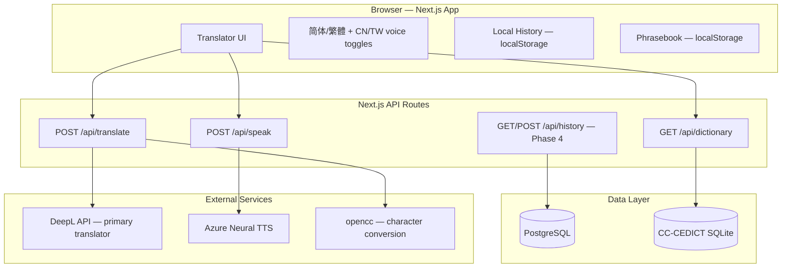

# Mind Your Language v2 — Design Spec

**Date:** 2026-07-13  
**Status:** Approved  
**Author:** awongCM + Cursor Agent  
**Replaces:** Legacy jQuery/Bootstrap v1 (`index.html`, CEDICT client-side lookup)

---

## 1. Vision

Mind Your Language v2 is a **Mandarin fluency grounding tool** for learners who already have strong intermediate speaking and writing skills but feel stuck below native-level fluency.

The product helps users translate phrases, sentences, and short paragraphs between English and Mandarin, then **calibrate** their phrasing against fluent reference — so they sound natural, not merely correct.

### Core promise

> Help intermediate Mandarin learners translate and verify their phrasing so they sound like a fluent speaker — not just passable.

### Target audience

| Segment | Description |
|---|---|
| **Primary (now)** | The founder — personal daily use for Mandarin practice |
| **Secondary (later)** | Intermediate learners (roughly HSK 4–6 / years of study) who want to break through to natural fluency |
| **Not for** | Absolute beginners learning first characters or basic grammar |

### What v1 got right (preserve the intent)

- Bidirectional EN ↔ ZH translation workflow
- Simplified + Traditional character display
- Pinyin with tone information
- CEDICT dictionary grounding (word-level nuance)
- Chinese input support in the browser
- Text-to-speech for pronunciation modeling
- Paragraph-length input, not just single words

### What v1 got wrong (do not port)

- jQuery 1.7, Bootstrap 2, Underscore templates
- Client-side parsing of a multi-megabyte CEDICT text file
- Hacked Google TTS with referrer workarounds
- Exposed API keys in client JavaScript
- Static Node file server with no API layer
- No user history, no auth-ready data model

---

## 2. Product positioning

**Category:** Fluency coach with translation superpowers — not a generic translator, not a beginner course.

**Differentiator vs Google Translate / DeepL:**

| Generic translator | Mind Your Language v2 |
|---|---|
| "What does this mean?" | "How would a fluent speaker say this?" |
| Single output | Translation + dictionary grounding + (later) native alternative |
| Transactional | Learning-oriented: save, revisit, refine |
| One-size-fits-all | Built for intermediate → fluent progression |

**Tagline (draft):** *From solid intermediate to natural fluency.*

---

## 3. Deployment strategy (Option B)

**Auth-ready, not auth-required.**

| Phase | Who uses it | Auth | Data storage |
|---|---|---|---|
| MVP (Phases 0–3) | Founder only | None | Local history + Postgres (nullable `userId`) |
| Private beta (Phase 4) | Early testers | Optional OAuth | Postgres per user |
| Public launch (Phase 5+) | Intermediate learners | Required for sync | Postgres + rate limits |

Design all tables and API contracts with `userId` from day one. MVP runs with `userId = null` and browser `localStorage` for history.

---

## 4. Mandarin variant support (Option C)

Support **both Mainland and Taiwan Mandarin** via user toggles, not a single locked locale.

### Character set toggle

| Mode | Characters | Default when |
|---|---|---|
| Simplified | 简体 | Source/target detected as Mainland context, or user preference |
| Traditional | 繁體 | User preference or Taiwan context |

Use the `opencc` library (or equivalent) for Simplified ↔ Traditional conversion when the translation engine returns only one form.

### TTS voice toggle

| Region | Azure Neural voice (primary) | Language code |
|---|---|---|
| Mainland | `zh-CN-XiaoxiaoNeural` | `zh-CN` |
| Taiwan | `zh-TW-HsiaoChenNeural` | `zh-TW` |

### Phrasing norms

- Translation API returns locale-neutral Chinese where possible; UI labels clarify "Mainland" vs "Taiwan" voice.
- Phase 2 "native alternative" prompt instructs the LLM to respect the active region toggle.
- Dictionary (CC-CEDICT) covers both forms; display both when available.

---

## 5. User flows

### 5.1 Primary flow — translate and ground

```
┌─────────────────────────────────────────────────────────────┐
│  [EN → ZH]  [ZH → EN]     [简体 | 繁體]     [🔊 CN | TW]   │
├─────────────────────────────────────────────────────────────┤
│  ┌─────────────────────────────────────────────────────┐   │
│  │  Enter phrase, sentence, or paragraph (≤ 500 chars)  │   │
│  └─────────────────────────────────────────────────────┘   │
│                                    [ Translate ]            │
├─────────────────────────────────────────────────────────────┤
│  RESULT                                                     │
│  ┌─ Translation ─────────────────────────────────────┐     │
│  │  你好，很高兴认识你。                              │     │
│  │  nǐ hǎo, hěn gāo xìng rèn shi nǐ.                │     │
│  │  你好，很高興認識你。 (Traditional toggle)         │     │
│  │  [▶ Play Mainland]  [▶ Play Taiwan]              │     │
│  └───────────────────────────────────────────────────┘     │
│  ┌─ Dictionary grounding ────────────────────────────┐     │
│  │  认识 — rèn shi — recognise, know (person)         │     │
│  │  高兴 — gāo xìng — happy, glad                     │     │
│  └───────────────────────────────────────────────────┘     │
│  [ Save to phrasebook ]  [ Copy ]                          │
└─────────────────────────────────────────────────────────────┘
```

### 5.2 History flow

- Sidebar or drawer: last 50 translations (MVP: `localStorage`; later: Postgres).
- Click to re-open full result with grounding panel.
- Copy or re-translate with edits.

### 5.3 Phase 2 flow — native alternative (post-MVP)

When machine translation sounds literal or textbook-ish, show:

- **Primary translation** (engine output)
- **Native alternative** (LLM rewrite: "how a fluent speaker would say this")
- Brief note on register (口语 / 书面 / neutral)

---

## 6. Feature scope

### MVP (Phases 0–3) — IN

| Feature | Details |
|---|---|
| Bidirectional translation | EN ↔ ZH, paragraph up to 500 characters |
| Character toggle | Simplified ↔ Traditional display |
| Pinyin | Tone-marked, segmented (`pinyin-pro`) |
| Dictionary grounding | CC-CEDICT lookup for segmented terms |
| TTS | Mainland (`zh-CN`) and Taiwan (`zh-TW`) voices |
| Chinese input helper | Browser-native IME + optional web IME plugin |
| Local history | 50 items in `localStorage` |
| Postgres schema | `users`, `translations`, `phrasebook` with nullable `userId` |
| Rate limiting | Per-IP limits on `/api/translate` |
| Responsive UI | Mobile-first, desktop-friendly |
| Deploy | Render Web Service |

### Phase 2 — IN

| Feature | Details |
|---|---|
| Native alternative | LLM rewrite when phrasing sounds non-native |
| Register labels | Casual / formal / neutral |
| Dual-engine compare | Primary + secondary translation source |

### Phase 4–5 — IN (public readiness)

| Feature | Details |
|---|---|
| OAuth login | Google or GitHub |
| Cloud phrasebook sync | Postgres per user |
| STT input | Web Speech API or Whisper |
| Onboarding | Intermediate-learner focused copy |

### Explicit non-goals (MVP)

- User accounts / OAuth
- Spaced repetition
- Pronunciation scoring
- Cantonese or other dialects
- Public API for third parties
- Monetization / billing

---

## 7. Architecture



### Component responsibilities

| Component | Responsibility |
|---|---|
| `apps/web` | Next.js 15 App Router frontend + API routes |
| `packages/dictionary` | CC-CEDICT index, lookup, segmentation helpers |
| `packages/shared` | Shared TypeScript types (`TranslationRecord`, etc.) |
| PostgreSQL | Auth-ready persistence; MVP tables created, lightly used |
| Render | Web service hosting, env secrets, Postgres add-on |

---

## 8. API design

All external API keys stay server-side. No secrets in client bundles.

### `POST /api/translate`

**Request:**
```json
{
  "text": "Hello, nice to meet you.",
  "sourceLang": "en",
  "targetLang": "zh",
  "characterSet": "simplified"
}
```

`sourceLang` and `targetLang`: `"en"` | `"zh"`.  
`characterSet`: `"simplified"` | `"traditional"`.

**Response:**
```json
{
  "id": "uuid",
  "translation": "你好，很高兴认识你。",
  "traditional": "你好，很高興認識你。",
  "pinyin": "nǐ hǎo, hěn gāo xìng rèn shi nǐ.",
  "detectedLang": "en",
  "segments": [
    { "text": "你好", "pinyin": "nǐ hǎo" },
    { "text": "很高兴", "pinyin": "hěn gāo xìng" },
    { "text": "认识你", "pinyin": "rèn shi nǐ" }
  ],
  "dictionaryMatches": [
    {
      "simplified": "认识",
      "traditional": "認識",
      "pinyin": "rèn shi",
      "definitions": ["recognise", "know (a person)"]
    }
  ]
}
```

**Errors:**
- `400` — empty text, exceeds 500 chars, invalid lang
- `429` — rate limit exceeded
- `502` — upstream translation API failure

### `GET /api/dictionary?q=认识&limit=5`

**Response:**
```json
{
  "entries": [
    {
      "simplified": "认识",
      "traditional": "認識",
      "pinyin": "rèn shi",
      "definitions": ["to know", "to recognize", "to be familiar with"]
    }
  ]
}
```

### `POST /api/speak`

**Request:**
```json
{
  "text": "你好，很高兴认识你。",
  "voice": "zh-CN"
}
```

`voice`: `"zh-CN"` | `"zh-TW"`.

**Response:** `audio/mpeg` stream or `{ "audioUrl": "..." }` (signed URL, 5 min TTL).

---

## 9. Data model

### `users` (created Phase 0, populated Phase 4)

```sql
CREATE TABLE users (
  id         UUID PRIMARY KEY DEFAULT gen_random_uuid(),
  email      TEXT UNIQUE,
  created_at TIMESTAMPTZ NOT NULL DEFAULT now()
);
```

### `translations` (created Phase 0)

```sql
CREATE TABLE translations (
  id                  UUID PRIMARY KEY DEFAULT gen_random_uuid(),
  user_id             UUID REFERENCES users(id),  -- NULL for anonymous/MVP
  source_text         TEXT NOT NULL,
  source_lang         TEXT NOT NULL CHECK (source_lang IN ('en', 'zh')),
  target_lang         TEXT NOT NULL CHECK (target_lang IN ('en', 'zh')),
  translation         TEXT NOT NULL,
  traditional         TEXT,
  pinyin              TEXT,
  character_set       TEXT NOT NULL DEFAULT 'simplified',
  native_alternative  TEXT,                        -- Phase 2
  register            TEXT,                        -- Phase 2: formal|casual|neutral
  dictionary_matches  JSONB NOT NULL DEFAULT '[]',
  created_at          TIMESTAMPTZ NOT NULL DEFAULT now()
);
```

### `phrasebook` (created Phase 3)

```sql
CREATE TABLE phrasebook (
  id              UUID PRIMARY KEY DEFAULT gen_random_uuid(),
  user_id         UUID REFERENCES users(id),
  translation_id  UUID REFERENCES translations(id),
  tags            TEXT[] DEFAULT '{}',
  notes           TEXT,
  created_at      TIMESTAMPTZ NOT NULL DEFAULT now()
);
```

### TypeScript shared types

```typescript
export type Lang = 'en' | 'zh'
export type CharacterSet = 'simplified' | 'traditional'
export type VoiceRegion = 'zh-CN' | 'zh-TW'
export type Register = 'formal' | 'casual' | 'neutral'

export interface DictionaryEntry {
  simplified: string
  traditional: string
  pinyin: string
  definitions: string[]
}

export interface TranslationSegment {
  text: string
  pinyin: string
}

export interface TranslationRecord {
  id: string
  userId: string | null
  sourceText: string
  sourceLang: Lang
  targetLang: Lang
  translation: string
  traditional?: string
  pinyin?: string
  characterSet: CharacterSet
  register?: Register
  nativeAlternative?: string
  dictionaryMatches: DictionaryEntry[]
  segments: TranslationSegment[]
  createdAt: string
}
```

---

## 10. Tech stack

| Layer | Choice | Rationale |
|---|---|---|
| Framework | Next.js 15 (App Router) + TypeScript | Modern, API routes, Render-friendly |
| Styling | Tailwind CSS + shadcn/ui | Accessible, fast to build |
| Translation | DeepL API (primary) | Strong EN↔ZH quality |
| Character conversion | `opencc-js` | Simplified ↔ Traditional toggle |
| Pinyin | `pinyin-pro` | Tone marks, segmentation |
| Dictionary | CC-CEDICT → SQLite | Same grounding as v1, indexed |
| TTS | Azure Neural TTS | Reliable `zh-CN` + `zh-TW` voices |
| Database | PostgreSQL (Render) | Auth-ready from day one |
| Local state | Zustand + localStorage | History without auth in MVP |
| Rate limiting | `@upstash/ratelimit` or in-memory | Protect API keys pre-launch |
| Testing | Vitest + Playwright | Unit + E2E critical paths |
| Deploy | Render Web Service | Matches project environment |

### Environment variables

```
DEEPL_API_KEY=
AZURE_TTS_KEY=
AZURE_TTS_REGION=eastus
DATABASE_URL=          # Render Postgres
RATE_LIMIT_PER_MIN=20
```

---

## 11. UI screens

### Screen 1 — Main translator (MVP)

- **Header:** Logo, language direction toggle, character set toggle (简体/繁體), voice region (CN/TW)
- **Input:** Large textarea, character count (max 500), Translate button with loading spinner
- **Result card:** Translation, pinyin, traditional (when toggle active), segmented words
- **Grounding panel:** Dictionary entries for key terms, collapsible
- **Actions:** Play Mainland, Play Taiwan, Save, Copy

### Screen 2 — History drawer (MVP)

- Last 50 translations, newest first
- Click to restore full result
- Clear all / copy actions

### Screen 3 — Phrasebook (Phase 3)

- Saved phrases with optional tags and notes
- Filter by tag

---

## 12. Error handling

| Scenario | User-facing behavior |
|---|---|
| Empty input | Inline validation: "Enter text to translate" |
| Text > 500 chars | Inline validation with char count |
| Translation API down | "Translation service unavailable. Try again." |
| Dictionary miss | Grounding panel shows "No dictionary matches" (non-blocking) |
| TTS failure | Toast: "Audio unavailable"; result still shown |
| Rate limit | "Too many requests. Wait a moment." |

---

## 13. Testing strategy

| Layer | What to test |
|---|---|
| Unit | `segmentChinese()`, pinyin generation, OpenCC conversion, CEDICT lookup |
| API integration | `/api/translate`, `/api/dictionary`, `/api/speak` with mocked upstreams |
| E2E (Playwright) | Full translate flow, toggle simplified/traditional, play TTS, save history |
| Manual | Voice quality CN vs TW, paragraph-length accuracy, mobile layout |

---

## 14. Success criteria

### MVP (personal use)

- [ ] Paste a Mandarin paragraph → accurate English reflecting intent
- [ ] Type English → natural Mandarin (not word-for-word)
- [ ] Toggle 简体/繁體 without re-translating
- [ ] Hear both Mainland and Taiwan TTS voices
- [ ] See dictionary grounding for key terms
- [ ] Revisit last 50 translations offline (localStorage)
- [ ] Deployed on Render, API keys not exposed

### Public launch (Phase 5)

- [ ] Intermediate learner completes onboarding in < 2 minutes
- [ ] Auth syncs phrasebook across devices
- [ ] Rate limits prevent API cost overrun
- [ ] "Native alternative" available for non-literal phrasing

---

## 15. Repository structure (greenfield)

```
mindyourlanguage/
├── apps/
│   └── web/                    # Next.js 15 app
│       ├── app/
│       │   ├── page.tsx        # Main translator
│       │   ├── api/
│       │   │   ├── translate/route.ts
│       │   │   ├── dictionary/route.ts
│       │   │   └── speak/route.ts
│       │   └── layout.tsx
│       ├── components/
│       │   ├── translator-form.tsx
│       │   ├── result-card.tsx
│       │   ├── grounding-panel.tsx
│       │   ├── history-drawer.tsx
│       │   └── toggles.tsx
│       └── lib/
│           ├── stores/history.ts
│           └── utils/
├── packages/
│   ├── dictionary/             # CC-CEDICT loader + lookup
│   └── shared/                 # Shared TypeScript types
├── scripts/
│   └── import-cedict.ts        # Build SQLite from CC-CEDICT
├── docs/
│   └── superpowers/
├── render.yaml
└── package.json                # npm workspaces root
```

Legacy v1 files remain in repo root until v2 ships; no modification to legacy code.

---

## 16. Open decisions (deferred)

| Decision | When to decide |
|---|---|
| OAuth provider (Google vs GitHub) | Phase 4 |
| LLM provider for native alternative | Phase 2 |
| Secondary translation engine | Phase 2 |
| Monetization model | Post-public launch |

---

## 17. Approval record

| Decision | Choice | Date |
|---|---|---|
| Audience strategy | Option B — personal now, public later | 2026-07-13 |
| Target user | Intermediate → fluent learners | 2026-07-13 |
| Architecture | Greenfield Next.js (Approach A) | 2026-07-13 |
| Mandarin variant | Option C — Simplified/Traditional + CN/TW TTS toggles | 2026-07-13 |
