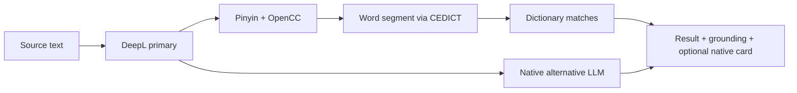

# Phase 2 — Dictionary Grounding + Native Alternative (Sequenced C)

**Date:** 2026-07-13  
**Status:** Approved  
**Author:** awongCM + Cursor Agent  
**Parent spec:** `docs/superpowers/specs/2026-07-13-mindyourlanguage-v2-design.md`  
**Parent plan:** `docs/superpowers/plans/2026-07-13-mindyourlanguage-v2.md`

---

## 1. Intent

Phase 1 delivered DeepL translation, pinyin, OpenCC character conversion, and the translator UI. `dictionaryMatches` is still always empty; `packages/dictionary` is a stub; native-alternative fields exist on `TranslationRecord` / Postgres but not on `TranslateResponse`.

This exercise adopts **Option C as the destination**: dictionary grounding **and** a live native alternative, so personal Mandarin practice becomes:

> translate → understand the words → see how a fluent speaker would say it → (later) hear it with TTS

Work is **sequenced as two PRs** (dictionary first, then native alternative) so later stages (TTS, history, deploy) stay clean.

### Why sequenced C

| Practice need | Dictionary (2a) | Native alternative (2b) |
|---|---|---|
| Writing that sounds natural | Explains words; does not fix textbook phrasing | Rewrites toward fluent register |
| Vocabulary depth | Strong — CEDICT grounding | Weak alone |
| Speaking confidence | Indirect | Helps *what* to say; TTS (Phase 3) helps *how it sounds* |

Dual-engine compare (listed under design-spec “Phase 2”) stays **out of scope**.

---

## 2. Scope & sequencing

### In scope

| PR | Delivers | Unlocks |
|---|---|---|
| **2a — Dictionary** | CEDICT → SQLite, word segmentation, `GET /api/dictionary`, enrich `/api/translate` with real `dictionaryMatches`, grounding panel UI | Word-level learning under every translation |
| **2b — Native alternative** | LLM rewrite + register (`formal` / `casual` / `neutral`), respect CN/TW preference, show alternative only when it meaningfully differs | Fluency calibration for writing |

### Out of scope (deferred)

- Dual-engine / secondary translation compare
- Azure TTS / `/api/speak` (plan Phase 3)
- Local history drawer (plan Phase 3)
- Render Blueprint / E2E suite (plan Phase 4)
- OAuth / cloud sync (plan Phase 5)

### Pipeline after both land

```
POST /api/translate
  → DeepL (primary)
  → OpenCC + pinyin
  → CEDICT segment + lookup          ← 2a
  → optional LLM native rewrite      ← 2b
  → response: translation, segments, dictionaryMatches,
              nativeAlternative?, register?, nativeNote?
```



---

## 3. PR 2a — Dictionary grounding

### 3.1 Data

- Import CC-CEDICT into `data/cedict.db` (SQLite).
- Prefer a fresh download from MDBG; fall back to `archive/legacy-v1/resource/cedict_1_0_ts_utf-8_mdbg.txt` if the network fetch fails.
- Schema:

```sql
CREATE TABLE entries (
  traditional TEXT NOT NULL,
  simplified  TEXT NOT NULL,
  pinyin      TEXT NOT NULL,
  definitions TEXT NOT NULL
);
CREATE INDEX idx_simplified ON entries(simplified);
CREATE INDEX idx_traditional ON entries(traditional);
```

- Root script `npm run import-cedict` builds the DB.
- Commit `data/.gitkeep` only — do **not** commit the multi‑MB DB. Generate locally and at deploy/build as needed.

### 3.2 Package `packages/dictionary`

| Export | Responsibility |
|---|---|
| `lookupTerm(term, limit?)` | Query SQLite → `DictionaryEntry[]` |
| `segment(text)` | Longest-match word segmentation against CEDICT |
| (internal) DB open helper | Resolve path to `data/cedict.db` |

- Upgrade replaces Phase 1 character-level `segmentChinese` for API enrichment paths (web `lib/pinyin.ts` may keep a thin wrapper or delegate to the package).
- CEDICT stays **server-side only** — API routes import the package; the browser never loads the dictionary file.

### 3.3 APIs

**`GET /api/dictionary?q=认识&limit=5`**

- Validate `q` non-empty; default/clamp `limit`.
- Return `{ entries: DictionaryEntry[] }`.

**Enrich `POST /api/translate`**

- When `targetLang === 'zh'`, run word `segment` → `lookupTerm` on the Chinese translation (same gate as Phase 1 pinyin/OpenCC enrichment).
- Fill `dictionaryMatches`: dedupe by simplified form, cap at **15** entries so the panel stays usable.
- Preserve existing pinyin / traditional enrichment.

### 3.4 UI

- New collapsible `grounding-panel` under the result card.
- Each row: simplified, traditional, pinyin, definitions.
- Empty state: “No dictionary matches for this translation.” (non-blocking).
- Result card segment chips use **word-level** segments from CEDICT.

### 3.5 Failure modes

| Scenario | Behavior |
|---|---|
| CEDICT DB missing / corrupt | Translate still succeeds; `dictionaryMatches: []`; grounding empty state; log server-side |
| Term miss | Skip that segment; panel may be partial |

---

## 4. PR 2b — Native alternative

### 4.1 When it runs

- Only for **EN → ZH** (primary “how would I say this?” practice).
- ZH → EN stays DeepL-only; `includeNativeAlternative` is ignored for that direction.
- Request flag: `includeNativeAlternative?: boolean`.
- UI default: **on** for EN→ZH (fluency loop always available); user can toggle off to save latency/cost.
- Skip LLM if DeepL Chinese output is empty or shorter than **2** Chinese characters.

### 4.2 LLM behavior

**Inputs:** source English, DeepL Chinese, active voice region (`zh-CN` | `zh-TW`).

**Structured output:**

```ts
{
  nativeAlternative: string
  register: 'formal' | 'casual' | 'neutral'
  note?: string
}
```

- Rewrite toward how a fluent speaker in that region would say it — natural, not textbook.
- If DeepL is already native-sounding, return the same text + `neutral`.
- UI hides the native card when the alternative does not meaningfully differ from the primary (normalize whitespace before compare).

**Register UI labels:** `formal` → 书面, `casual` → 口语, `neutral` → 中性.

### 4.3 Provider

- **OpenAI** (`gpt-4o-mini` or model from env) via server-side `OPENAI_API_KEY`.
- Isolate calls in `apps/web/lib/native-alternative.ts` so Azure/Anthropic can swap later.
- Keys never ship to the client.
- Share the existing translate rate limiter (or a slightly stricter cap on the LLM path).

### 4.4 API / types

Extend shared types:

```ts
// TranslateRequest
includeNativeAlternative?: boolean

// TranslateResponse
nativeAlternative?: string
register?: Register
nativeNote?: string
```

Postgres `native_alternative` / `register` columns already exist from Phase 0 — no migration required for MVP (responses remain ephemeral until history/cloud sync).

### 4.5 UI

- `native-alternative-card` below the primary result (near grounding): alternative text, register chip, optional short note.
- Show only when `nativeAlternative` is present and differs from primary.
- Character-set toggle applies OpenCC to the alternative the same way as the primary line.
- No dual-engine compare UI.

### 4.6 Environment

```
OPENAI_API_KEY=
NATIVE_ALT_MODEL=gpt-4o-mini
```

### 4.7 Failure modes

| Scenario | Behavior |
|---|---|
| LLM timeout / 5xx / bad JSON | Omit native fields; primary translation still 200; optional toast: “Native alternative unavailable” |
| Rate limit | Existing 429 copy covers DeepL + LLM path |
| Flag set on ZH→EN | Ignored server-side |

---

## 5. Error handling summary

| Scenario | User-facing behavior |
|---|---|
| Empty / oversized input | Unchanged Phase 1 validation |
| DeepL down | Unchanged 502 |
| Dictionary miss / DB missing | Non-blocking empty grounding |
| LLM failure | Non-blocking omit native fields |
| Rate limit | “Too many requests. Wait a moment.” |

**Invariant:** Dictionary and LLM failures must never break the primary DeepL result.

---

## 6. Testing strategy

| Layer | 2a Dictionary | 2b Native alternative |
|---|---|---|
| Unit | CEDICT parse/import on a sample, `lookupTerm`, longest-match `segment` | Response parser, “differs from primary” helper, register label mapping |
| API | `/api/dictionary`; translate returns non-empty `dictionaryMatches` against a fixture DB | Translate with flag + mocked LLM; LLM failure still 200 with primary only |
| Manual | EN→ZH with 认识 / 高兴; toggle 繁體; ZH→EN still works | EN→ZH shows alternative + 口语/书面/中性; toggle off skips LLM |

---

## 7. Success criteria

- [ ] Every ZH-oriented result has word-level segments and useful dictionary rows when terms exist in CEDICT
- [ ] Grounding panel is readable and non-blocking
- [ ] EN→ZH can show a native alternative + register when the model suggests a real change
- [ ] LLM/dictionary failures never break the primary DeepL result
- [ ] `TranslateResponse` shape is ready for TTS/history to attach later without reshaping the core contract

---

## 8. File map (expected)

### PR 2a

| File | Responsibility |
|---|---|
| `scripts/import-cedict.ts` | CC-CEDICT → SQLite importer |
| `data/.gitkeep` | Data directory placeholder |
| `packages/dictionary/src/lookup.ts` | Term lookup |
| `packages/dictionary/src/segment.ts` | Longest-match segmentation |
| `packages/dictionary/src/index.ts` | Package exports |
| `apps/web/app/api/dictionary/route.ts` | `GET /api/dictionary` |
| `apps/web/app/api/translate/route.ts` | Attach `dictionaryMatches` + word segments |
| `apps/web/components/grounding-panel.tsx` | Grounding UI |
| `apps/web/app/page.tsx` | Wire panel under result |

### PR 2b

| File | Responsibility |
|---|---|
| `packages/shared/src/types.ts` | Extend request/response types |
| `apps/web/lib/native-alternative.ts` | LLM client + parse |
| `apps/web/app/api/translate/route.ts` | Optional native enrichment |
| `apps/web/components/native-alternative-card.tsx` | Alternative + register UI |
| `apps/web/app/page.tsx` / form toggles | `includeNativeAlternative` default on for EN→ZH |
| `apps/web/.env.example` | Document `OPENAI_API_KEY`, `NATIVE_ALT_MODEL` |

---

## 9. Relationship to parent plan

| Parent plan item | This exercise |
|---|---|
| Phase 2 Tasks 8–9 (CEDICT + grounding panel) | **PR 2a** — implement now |
| Phase 5 Task 15 (native alternative) | **PR 2b** — pull forward immediately after 2a, before TTS |
| Dual-engine compare | Deferred |
| Phase 3 TTS / history | After this exercise |

---

## 10. Open decisions (closed here)

| Decision | Choice |
|---|---|
| Destination | Option C — dictionary + live native alternative |
| Execution style | Sequenced PRs (2a then 2b), not one combined PR |
| LLM provider | OpenAI (`NATIVE_ALT_MODEL`, default `gpt-4o-mini`) |
| Native alternative direction | EN→ZH only |
| Dual-engine compare | Out of scope |

---

## 11. Approval record

| Decision | Choice | Date |
|---|---|---|
| Explore both Phase 2 meanings | Option C | 2026-07-13 |
| Approach for effectiveness | Sequenced C (dictionary then native alt before TTS) | 2026-07-13 |
| §1 Scope & sequencing | Approved | 2026-07-13 |
| §2 Dictionary grounding | Approved | 2026-07-13 |
| §3 Native alternative | Approved | 2026-07-13 |
| §4 Errors, testing, success | Approved | 2026-07-13 |
