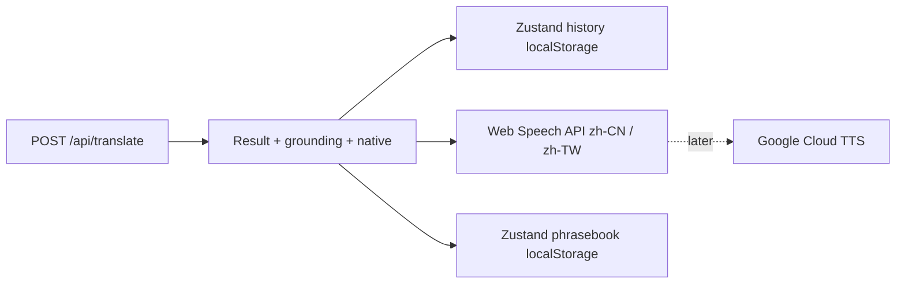

# Phase 3 — Web Speech TTS + History + Phrasebook

**Date:** 2026-07-14  
**Status:** Draft (pending approval)  
**Author:** awongCM + Cursor Agent  
**Parent spec:** `docs/superpowers/specs/2026-07-13-mindyourlanguage-v2-design.md`  
**Parent plan:** `docs/superpowers/plans/2026-07-13-mindyourlanguage-v2.md`

---

## 1. Intent

Phases 0–2 delivered translation, dictionary grounding, and native alternative. Play buttons are still stubs (“coming soon”). There is no history drawer and no phrasebook UI.

Phase 3 closes the personal MVP loop:

> translate → ground words → see native phrasing → **hear it** → **revisit** → **save favorites**

### TTS provider decision (locked)

| Choice | Rationale |
|---|---|
| **Web Speech API** (`speechSynthesis`) for MVP | Zero new accounts/keys; zero server cost; ships Play buttons immediately |
| **Google Cloud TTS** later | Revisit when quality or CN/TW voice availability on devices is insufficient |
| **Azure TTS** | Dropped — no Azure account; not required for PoC/MVP |

Parent plan Task 10 assumed Azure Neural TTS. This exercise **replaces** that with client-side Web Speech while preserving the same UX contract (Play Mainland / Play Taiwan).

### Why phrasebook is in (and opt-outable)

Design Screen 3 calls for a phrasebook. Shipping it now completes the “save what I want to practice” path. Implementation keeps phrasebook in **isolated** store + components so it can be hidden or removed later without touching TTS or history.

---

## 2. Scope & sequencing

### In scope

| PR | Delivers | Unlocks |
|---|---|---|
| **3a — Web Speech TTS** | Client `speakChinese` helper, enable Play Mainland / Play Taiwan, toast on failure | Hear translations without any TTS vendor account |
| **3b — Local history** | Zustand + `localStorage` (max 50), history drawer, auto-save on translate, restore on click | Revisit recent practice offline |
| **3c — Local phrasebook** | Zustand + `localStorage`, Save to phrasebook, phrasebook drawer with tags/notes/filter | Keep favorites beyond the rolling 50 history |

### Out of scope (deferred)

- Google Cloud TTS / Azure TTS / `/api/speak` audio proxy
- Postgres writes for history or phrasebook (tables already exist; cloud sync = Phase 4–5)
- Dual-engine compare
- Render Blueprint / Playwright E2E (plan Phase 4)
- OAuth / cloud sync (plan Phase 5)

### Pipeline after Phase 3

```
Translate success
  → show result + grounding + optional native alt
  → auto-add TranslationRecord to history (local)
  → Play buttons → speechSynthesis (zh-CN / zh-TW)
  → optional Save → phrasebook entry (local)
```



---

## 3. PR 3a — Web Speech TTS

### 3.1 Behavior

- **Play Mainland** → speak displayed Chinese with a `zh-CN` (or `cmn-CN`) voice when available.
- **Play Taiwan** → speak with a `zh-TW` (or `cmn-TW`) voice when available.
- Text to speak: the **currently displayed** translation string (respects 简体/繁體 toggle). Prefer primary translation; optionally allow speaking native alternative later (not required for MVP).
- Cancel any in-progress utterance before starting a new one.
- If `speechSynthesis` is missing, or no usable voice / speak fails → toast: “Audio unavailable”.

### 3.2 Voice selection

```ts
function pickVoice(region: VoiceRegion): SpeechSynthesisVoice | null
```

Priority:

1. Exact match on `voice.lang` (`zh-CN` / `zh-TW`)
2. Prefix match (`zh-CN*`, `zh-TW*`, `cmn-CN*`, `cmn-TW*`)
3. Fallback: any `zh*` / `cmn*` voice + still set `utterance.lang` to the requested region
4. If none: return null → toast

Voices may load asynchronously (`voiceschanged`). Helper should wait briefly / re-query before failing.

### 3.3 API surface

No server route for MVP. Keep a **client-only** helper so a future Google path can share the UI:

| Export | Responsibility |
|---|---|
| `speakChinese(text, region)` | Pick voice, speak, return Promise that settles on end/error |
| `cancelSpeech()` | `speechSynthesis.cancel()` |
| `isSpeechSynthesisSupported()` | Feature detect |

Future Google upgrade: add `POST /api/speak` + swap the Play handlers; UI labels stay the same.

### 3.4 UI

- Enable the existing disabled Play buttons in `result-card.tsx`.
- Disable or show busy state while speaking (optional; cancel+restart is enough).
- Do **not** require the header voice-region toggle to match the button — buttons stay explicit Mainland / Taiwan.

### 3.5 Failure modes

| Scenario | Behavior |
|---|---|
| Unsupported browser | Toast; buttons can stay enabled but fail gracefully |
| Voices empty / wrong locale | Fallback voice or toast |
| Empty translation | No-op |
| User navigates away mid-speech | Cancel on unmount |

---

## 4. PR 3b — Local history

### 4.1 Store

Zustand + `persist` middleware, key `myl-history`.

```ts
interface HistoryStore {
  items: TranslationRecord[]
  add: (record: TranslationRecord) => void
  remove: (id: string) => void
  clear: () => void
}
```

- Cap at **50** items (newest first).
- `TranslationRecord` already exists in `@mindyourlanguage/shared`.

### 4.2 Record assembly

On successful translate, build a full record (not just `TranslateResponse`):

| Field | Source |
|---|---|
| `id` | Response `id` |
| `userId` | `null` |
| `sourceText` | Request text |
| `sourceLang` / `targetLang` | Form direction |
| `translation`, `traditional`, `pinyin`, `segments`, `dictionaryMatches` | Response |
| `characterSet` | Active toggle |
| `nativeAlternative` / `register` | Response if present |
| `createdAt` | `new Date().toISOString()` |

### 4.3 UI

- `history-drawer.tsx` using existing shadcn `Sheet`.
- Header trigger: “History” in the app header (or page toolbar).
- List: source snippet → translation snippet, newest first.
- Click item → restore result + form direction + character set + native fields on the main page.
- Actions: Clear all; optional per-item remove; Copy translation.

### 4.4 Failure modes

| Scenario | Behavior |
|---|---|
| `localStorage` full / blocked | Toast once; translate still works |
| Corrupt persisted JSON | Reset to `[]` |

---

## 5. PR 3c — Local phrasebook (opt-outable)

### 5.1 Isolation rule

Phrasebook lives in:

- `lib/stores/phrasebook.ts`
- `components/phrasebook-drawer.tsx`
- Save button wiring in `result-card` / page

No history or TTS logic depends on phrasebook. To opt out later: remove the Save button + drawer trigger + store import (or gate behind `NEXT_PUBLIC_ENABLE_PHRASEBOOK=true`).

### 5.2 Store

Zustand + persist, key `myl-phrasebook`.

```ts
export interface PhrasebookEntry {
  id: string
  translationId: string | null
  sourceText: string
  sourceLang: Lang
  targetLang: Lang
  translation: string
  traditional?: string
  pinyin?: string
  characterSet: CharacterSet
  nativeAlternative?: string
  tags: string[]
  notes: string
  createdAt: string
}
```

| Action | Behavior |
|---|---|
| `add(entry)` | Prepend; dedupe by `translationId` or normalized `sourceText+translation` |
| `update(id, patch)` | Tags / notes |
| `remove(id)` | Delete one |
| `clear()` | Wipe |

No hard cap required for MVP (personal use); soft guidance: keep UI snappy under a few hundred entries.

### 5.3 UI

- **Save to phrasebook** button next to Copy on the result card.
- If already saved → button shows Saved / allows unsave (toggle).
- `phrasebook-drawer.tsx`: list saved phrases; optional tag filter; edit notes; remove; click to restore like history.
- Header trigger: “Phrasebook”.

### 5.4 Postgres

`phrasebook` table already exists from Phase 0. **Do not** write to Postgres in Phase 3. Cloud sync waits for auth.

### 5.5 Failure modes

Same localStorage rules as history. Save failures never break translate/TTS.

---

## 6. Error handling summary

| Scenario | User-facing behavior |
|---|---|
| TTS unsupported / fail | “Audio unavailable” |
| History persist fail | Toast; translate OK |
| Phrasebook persist fail | Toast; translate OK |
| Empty play text | No-op |

**Invariant:** TTS, history, and phrasebook failures never break the primary DeepL result.

---

## 7. Testing strategy

| Layer | 3a TTS | 3b History | 3c Phrasebook |
|---|---|---|---|
| Unit | Voice picker with mocked `speechSynthesis.getVoices()`; cancel; unsupported path | `add` caps at 50; remove/clear | Dedupe add; tag filter helper |
| Component | Play buttons call speak with correct region | Drawer lists/restores (RTL or light harness) | Save toggles saved state |
| Manual | Chrome + Safari: CN vs TW; traditional text | Translate → reopen from History | Save → filter by tag → restore |

Note: Web Speech quality varies by OS; document that Google TTS remains the upgrade path.

---

## 8. Success criteria

- [ ] Play Mainland / Play Taiwan produce audible Mandarin when the browser has suitable voices
- [ ] TTS failure shows a toast and does not clear the result
- [ ] Last 50 translations persist across refresh and restore full result context
- [ ] Save to phrasebook stores favorites with optional tags/notes; drawer can filter and restore
- [ ] Phrasebook can be removed later without rewriting TTS or history
- [ ] No new paid TTS vendor or API keys required for Phase 3

---

## 9. File map (expected)

### PR 3a

| File | Responsibility |
|---|---|
| `apps/web/lib/speech.ts` | Web Speech helpers |
| `apps/web/lib/speech.test.ts` | Voice pick / support tests |
| `apps/web/components/result-card.tsx` | Wire Play buttons |

### PR 3b

| File | Responsibility |
|---|---|
| `apps/web/lib/stores/history.ts` | Zustand history store |
| `apps/web/lib/stores/history.test.ts` | Cap / mutate tests |
| `apps/web/components/history-drawer.tsx` | History Sheet UI |
| `apps/web/app/page.tsx` | Save on translate + restore |
| `apps/web/app/layout.tsx` or page header | History trigger |
| `apps/web/package.json` | Add `zustand` |

### PR 3c

| File | Responsibility |
|---|---|
| `packages/shared/src/types.ts` | `PhrasebookEntry` type |
| `apps/web/lib/stores/phrasebook.ts` | Zustand phrasebook store |
| `apps/web/components/phrasebook-drawer.tsx` | Phrasebook Sheet UI |
| `apps/web/components/result-card.tsx` | Save / Saved toggle |
| `apps/web/app/page.tsx` / layout | Phrasebook trigger + restore |

### Explicitly not created

| File | Why |
|---|---|
| `apps/web/app/api/speak/route.ts` | Deferred until Google (or other) cloud TTS |
| `apps/web/lib/tts.ts` (Azure) | Replaced by `lib/speech.ts` |

---

## 10. Relationship to parent plan

| Parent plan item | This exercise |
|---|---|
| Phase 3 Task 10 (Azure TTS + `/api/speak`) | **Replaced** by Web Speech client helper (PR 3a) |
| Phase 3 Task 11 (history store + drawer) | **PR 3b** — implement now |
| Design Screen 3 (phrasebook) | **PR 3c** — implement now, opt-outable |
| Google / Azure server TTS | Deferred revisit |
| Phase 4 Render / E2E | After this exercise |

---

## 11. Open decisions (closed here)

| Decision | Choice |
|---|---|
| TTS for MVP | Web Speech API (client-side) |
| Cloud TTS | Revisit Google Cloud TTS later; Azure out |
| History storage | Zustand + localStorage (`myl-history`, max 50) |
| Phrasebook | In scope, isolated, localStorage; Postgres unused until auth |
| Opt-out path | Remove/hide phrasebook UI + store without TTS/history changes |

---

## 12. Approval record

| Decision | Choice | Date |
|---|---|---|
| Drop Azure for Phase 3 | Yes | 2026-07-14 |
| MVP TTS | Web Speech API | 2026-07-14 |
| Google TTS | Later upgrade path | 2026-07-14 |
| Phrasebook in Phase 3 | Yes (opt-outable) | 2026-07-14 |
| §1–11 Design | Pending approval | 2026-07-14 |
