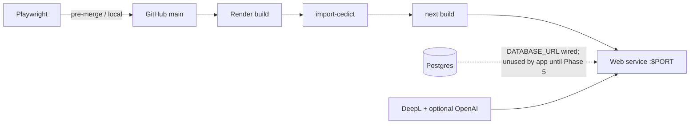

# Phase 4 — Render Deploy + Playwright E2E

**Date:** 2026-07-15  
**Status:** Draft (pending approval)  
**Author:** awongCM + Cursor Agent  
**Parent spec:** `docs/superpowers/specs/2026-07-13-mindyourlanguage-v2-design.md`  
**Parent plan:** `docs/superpowers/plans/2026-07-13-mindyourlanguage-v2.md`  
**Prior phase:** Phase 3 approved — Web Speech TTS + local history + phrasebook (PR #8)

---

## 1. Intent

Phases 0–3 delivered a working personal MVP locally:

> translate → ground words → see native phrasing → hear it → revisit → save favorites

There is still **no** `render.yaml`, no production health check, no CEDICT build step for deploy, and no Playwright suite. The parent plan’s Phase 4 (Tasks 12–13) is Deploy + E2E.

Phase 4 ships a **deployable, smoke-tested** personal MVP on Render — without OAuth or cloud sync.

### Scope clarification vs parent design

| Source | Says about “Phase 4” | This exercise |
|---|---|---|
| Parent plan Tasks 12–13 | Render Blueprint + Playwright E2E | **In scope** |
| Parent design “Private beta (Phase 4)” | Optional OAuth + Postgres per user | **Out of scope** — stays Phase 5 |
| Parent architecture diagram | `/api/speak` (Azure), `/api/history` Phase 4 | **Not built** — TTS is Web Speech; history stays localStorage |

This exercise **implements parent-plan Phase 4** and **defers** parent-design “public readiness” OAuth/sync to Phase 5.

### Why deploy before auth

The founder needs a URL for daily practice. Auth-ready Postgres already exists from Phase 0; wiring OAuth is a larger product change and is not required for a single-user deploy.

---

## 2. Scope & sequencing

### In scope

| PR | Delivers | Unlocks |
|---|---|---|
| **4a — Deploy readiness** | `render.yaml`, production start/bind, CEDICT import in build, `/api/health`, env docs, README deploy notes | App boots on Render with secrets in Dashboard |
| **4b — Playwright E2E** | Playwright config + critical-path specs (mocked API for CI; optional live smoke) | Regression safety before/after deploys |

### Out of scope (deferred)

- OAuth / NextAuth / login UI (plan Phase 5)
- Cloud history / phrasebook sync / `GET|POST /api/history`
- Google Cloud TTS / Azure TTS / `/api/speak`
- Dual-engine compare
- Custom domain (optional later; `onrender.com` is enough for MVP)
- CI provider setup beyond documenting how to run Playwright locally/CI

### Pipeline after Phase 4

```
git push → Render build
  → npm ci
  → import CEDICT → data/cedict.db
  → npm run build (Next.js)
  → start on 0.0.0.0:$PORT
  → health check /api/health
  → founder uses app; history/phrasebook remain device-local
```



---

## 3. PR 4a — Deploy readiness

### 3.1 Render Blueprint

Commit `render.yaml` at the repo root.

| Resource | Spec |
|---|---|
| Web service | `type: web`, `runtime: node`, monorepo root as rootDir |
| Postgres | Managed DB for auth-ready schema; **app does not write history/phrasebook yet** |
| Region | `oregon` (default; changeable before first create) |
| Plan | Free/starter-friendly for personal MVP; document Free spin-down (15 min) and Free Postgres expiry (30 days) |

**Build command (locked):**

```bash
npm ci && npm run import-cedict && npm run build
```

**Start command (locked):**

```bash
npm run start -w apps/web -- -H 0.0.0.0 -p $PORT
```

Rationale:

- Bind `0.0.0.0:$PORT` per Render port-binding rules.
- CEDICT SQLite is gitignored (`data/cedict.db`); import during build so the filesystem artifact exists at runtime.
- Import prefers `data/cedict.txt` if present; otherwise falls back to `archive/legacy-v1/resource/cedict_1_0_ts_utf-8_mdbg.txt` (already in repo) — **no network fetch required** for a successful deploy.

### 3.2 Environment variables

| Key | Required | Source | Notes |
|---|---|---|---|
| `DEEPL_API_KEY` | Yes | Dashboard `sync: false` | Primary translate |
| `OPENAI_API_KEY` | No | Dashboard `sync: false` | Native alternative; omit → feature skips gracefully |
| `NATIVE_ALT_MODEL` | No | Optional default `gpt-4o-mini` | Already supported |
| `DATABASE_URL` | Yes (Blueprint) | `fromDatabase` | Wire now; unused by translate path until Phase 5 |
| `CEDICT_DB_PATH` | No | Optional | Default resolver finds `data/cedict.db` from repo root / web cwd |
| `RATE_LIMIT_PER_MIN` | No | Default `20` | Keep for abuse guard |
| Azure / Google TTS keys | **Not used** | — | Removed from Phase 4 Blueprint; Web Speech is client-side |

Update `apps/web/.env.example` to match (no Azure required keys). Document Free-tier caveats in README.

### 3.3 Health check

Add `GET /api/health` returning JSON:

```json
{
  "ok": true,
  "cedict": true,
  "deeplConfigured": true
}
```

| Field | Meaning |
|---|---|
| `ok` | Process is up; HTTP 200 when true |
| `cedict` | `data/cedict.db` (or `CEDICT_DB_PATH`) openable |
| `deeplConfigured` | `DEEPL_API_KEY` non-empty (boolean only — never echo the key) |

Render health check path: `/api/health`.

Failure modes:

| Scenario | Behavior |
|---|---|
| Missing CEDICT | `ok: false`, `cedict: false`, HTTP 503 — deploy should fail health until import fixed |
| Missing DeepL key | `ok: false`, `deeplConfigured: false`, HTTP 503 — translate would fail anyway |
| OpenAI missing | Still `ok: true` if CEDICT + DeepL OK — native alt is optional |

### 3.4 Postgres migrations

- Keep `db/migrations/001_initial.sql` as source of truth.
- Phase 4 **documents** running migrations once against Render Postgres (Dashboard shell / `psql` / one-shot note in README).
- Do **not** add an automatic migration runner in the web start path unless cheap and reliable; prefer explicit one-time apply for personal MVP.
- App routes must not require Postgres to serve translate/dictionary in Phase 4.

### 3.5 Native modules / build notes

- `better-sqlite3` is a native addon — Blueprint uses Node runtime so `npm ci` compiles for Linux.
- `serverExternalPackages: ["better-sqlite3"]` already set in `next.config.ts`.
- Do not rely on macOS-built `.node` binaries in git.

### 3.6 README / root docs

Update root `README.md` status:

- Phase 3 complete
- Phase 4 design/plan links
- Deploy section: Blueprint sync, required secrets, Free-tier notes, CEDICT build step

---

## 4. PR 4b — Playwright E2E

### 4.1 Goals

Protect the personal MVP loop without requiring live DeepL/OpenAI in default CI runs.

| Spec | Asserts |
|---|---|
| Translate happy path (mocked) | Fill text → Translate → result + grounding UI appear |
| Character toggle | 简体 / 繁體 toggle updates displayed translation when traditional provided |
| History drawer | After mocked translate, History lists entry; select restores source + result |
| Phrasebook save | Save → Phrasebook lists entry |
| Play buttons | For ZH target, Play Mainland / Play Taiwan are enabled (do not require audible audio in CI) |

### 4.2 Mocking strategy (locked)

- Default E2E **route-mocks** `POST /api/translate` (and dictionary if needed) with a fixture `TranslateResponse`.
- Optional project/grep tag `@live` for a smoke that hits real APIs when `DEEPL_API_KEY` is present — skipped otherwise.
- Do **not** mock Web Speech in a way that flakes CI; only assert controls exist / click does not crash the page.

### 4.3 Tooling

| Piece | Choice |
|---|---|
| Runner | `@playwright/test` in `apps/web` |
| Browser | Chromium only for MVP |
| Config | `apps/web/playwright.config.ts` |
| Specs | `apps/web/e2e/*.spec.ts` |
| Scripts | `test:e2e` in `apps/web/package.json`; root script optional |

### 4.4 Failure modes

| Scenario | Behavior |
|---|---|
| Dev server not up | Playwright `webServer` starts `npm run dev -w apps/web` |
| Live test without key | Skip with clear message |
| TTS no voices in CI | Buttons still clickable; no hard assert on audio |

---

## 5. Error handling summary

| Scenario | User / operator facing |
|---|---|
| Deploy missing `DEEPL_API_KEY` | Health 503; Render shows unhealthy |
| CEDICT import failed in build | Build fails or health `cedict: false` |
| Free web spun down | Cold start delay; document in README |
| Free Postgres expired | Document recreate + re-run migration; app translate still works without PG |
| E2E without mocks against empty API | Default suite uses mocks — must not depend on secrets |

**Invariant:** Production translate/dictionary must work with DeepL + CEDICT alone. OpenAI and Postgres are optional for the Phase 4 runtime path.

---

## 6. Testing strategy

| Layer | 4a Deploy | 4b E2E |
|---|---|---|
| Unit | Health route: missing key / missing DB → 503; happy → 200 | — |
| Integration / manual | Blueprint validate (Render CLI if available); one real deploy smoke | Playwright Chromium mocked suite green |
| Live (optional) | Hit `/api/health` and one translate on `*.onrender.com` | `@live` translate smoke when key present |

---

## 7. Success criteria

- [ ] `render.yaml` provisions web + Postgres; no Azure TTS env vars
- [ ] Build imports CEDICT and produces a runnable Next.js app on `0.0.0.0:$PORT`
- [ ] `GET /api/health` reports CEDICT + DeepL readiness; used as Render health check
- [ ] README documents secrets, Free-tier limits, and one-time migration
- [ ] Playwright mocked suite covers translate UI, toggles, history, phrasebook, play controls
- [ ] Default E2E run needs no paid API keys
- [ ] No OAuth / cloud sync / `/api/speak` introduced

---

## 8. File map (expected)

### PR 4a

| File | Responsibility |
|---|---|
| `render.yaml` | Blueprint: web + Postgres + env wiring |
| `apps/web/app/api/health/route.ts` | Health JSON + status codes |
| `apps/web/app/api/health/route.test.ts` | Unit tests for health |
| `apps/web/package.json` | Ensure `start` accepts host/port (Next defaults OK) |
| `package.json` | Confirm `import-cedict` / `build` / `start` scripts for Render |
| `apps/web/.env.example` | Align with Phase 4 secrets (no Azure required) |
| `README.md` | Status + deploy section |

### PR 4b

| File | Responsibility |
|---|---|
| `apps/web/playwright.config.ts` | Chromium, webServer, baseURL |
| `apps/web/e2e/fixtures/translate-response.json` | Stable mock payload |
| `apps/web/e2e/translate.spec.ts` | Mocked translate + toggle |
| `apps/web/e2e/history-phrasebook.spec.ts` | History + phrasebook flows |
| `apps/web/package.json` | `test:e2e` script + Playwright dep |

### Explicitly not created

| File | Why |
|---|---|
| `apps/web/app/api/speak/route.ts` | Deferred; Web Speech remains client-only |
| `apps/web/app/api/history/route.ts` | Deferred to Phase 5 cloud sync |
| Auth routes / NextAuth | Phase 5 |

---

## 9. Relationship to parent plan

| Parent plan item | This exercise |
|---|---|
| Phase 4 Task 12 (Render Blueprint + `.env.example`) | **PR 4a** — rewrite env list without Azure; add health + CEDICT build |
| Phase 4 Task 13 (Playwright E2E) | **PR 4b** — expand beyond two smoke tests; default mocked |
| Parent design Phase 4 OAuth / private beta | **Deferred to Phase 5** |
| Azure TTS keys in Task 12 sample YAML | **Dropped** — obsolete after Phase 3 |

---

## 10. Open decisions (closed here)

| Decision | Choice |
|---|---|
| Phase 4 meaning | Deploy + E2E (parent plan), not OAuth |
| TTS on Render | Still Web Speech in the browser; no server TTS |
| CEDICT on deploy | Build-time `npm run import-cedict` from repo fallback text |
| Postgres in Blueprint | Yes — provision + document migration; unused by app runtime |
| Health check | `/api/health` with CEDICT + DeepL booleans |
| E2E default mode | Mocked APIs; optional `@live` when keys exist |
| Custom domain | Out of scope |

---

## 11. Approval record

| Decision | Choice | Date |
|---|---|---|
| Phase 4 = Deploy + E2E only | Yes | 2026-07-15 |
| OAuth deferred to Phase 5 | Yes | 2026-07-15 |
| CEDICT via build-time import | Yes | 2026-07-15 |
| Postgres provisioned but unused by app | Yes | 2026-07-15 |
| Default E2E mocked (no keys) | Yes | 2026-07-15 |
| §1–10 Design | Pending approval | 2026-07-15 |
