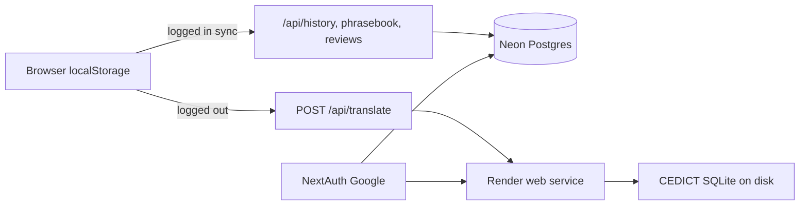

# Phase 6 — Public Readiness

**Date:** 2026-07-19  
**Revised:** 2026-09-26 (cloud persistence — Neon Postgres)  
**Status:** Approved (revised 2026-09-26)  
**Author:** awongCM + Cursor Agent  
**Parent spec:** `docs/superpowers/specs/2026-07-13-mindyourlanguage-v2-design.md`  
**Parent plan:** `docs/superpowers/plans/2026-07-13-mindyourlanguage-v2.md` (Tasks 14–15)  
**Implementation plan:** `docs/superpowers/plans/2026-09-26-phase-6-public-readiness-neon.md`  
**Depends on:** Phases 0–5 shipped; Render web service deployable from Blueprint  
**Prior phase:** Phase 5 — production practice (client-first; SRS + phrasebook in `localStorage`)

---

## 1. Intent

Phases 0–4 delivered a deployable personal MVP. Phase 5 adds productive practice (try-first, drill, SRS). Phase 6 is the **public launch** gate:

> OAuth login → cloud sync for history + phrasebook + SRS + review events → rate limits → optional STT input

The app stays on **Render** (web service). **User data** moves to **Neon Postgres** instead of Render Postgres. Render’s free Postgres databases expire after ~30 days and cannot be recreated on the same account; Neon’s free tier does not expire, which makes it a better fit for long-lived cloud sync.

### Relationship to Phase 5

Phase 5 keeps all practice data in `localStorage` (`myl-history`, `myl-phrasebook`, `myl-review-events`). Phase 6 syncs those shapes to Postgres when the user is authenticated — without breaking anonymous/local-only use. Translate and dictionary must keep working when the user is logged out or when Neon is unavailable.

---

## 2. Infrastructure

### 2.1 Host split

| Component | Provider | Notes |
|---|---|---|
| Next.js web app | Render web service (`mindyourlanguage`, Oregon) | Unchanged: `render.yaml` web service, CEDICT import at build, `/api/health` |
| Postgres | **Neon** (one project) | Cloud sync + OAuth user rows |
| Render Postgres | **Removed** from Blueprint | Drop `databases:` block and `fromDatabase` wiring in Phase 6 deploy PR |

### 2.2 Neon project setup

1. Create a Neon account and a **Free** project (no credit card required; not time-limited like Render free Postgres).
2. Prefer region **AWS US West (Oregon) — `aws-us-west-2`** to sit near the Render Oregon web service.
3. Copy the **direct** connection string (hostname **without** `-pooler`), with TLS: `sslmode=require`.
4. In Render Dashboard → web service → **Environment**, set `DATABASE_URL` as a secret (`sync: false`), same pattern as `DEEPL_API_KEY`.
5. Apply migrations once against Neon (local `psql`, Neon SQL Editor, or CI one-shot — not at Next.js build time).

**Connection choice:** Use a **direct** URL and a small server-side pool (e.g. `pg` with `max: 5–10`). Do not use Neon’s PgBouncer pooler for this app unless connection counts become a problem; one long-running Node process on Render does not need transaction pooling.

### 2.3 Neon Free limits (operational)

| Limit | Free plan behavior | App impact |
|---|---|---|
| Storage | 0.5 GB / project | Enough for early users; monitor growth |
| Compute | 100 CU-hours / month; scale-to-zero after ~5 min idle | Cold start on first query after idle (~hundreds of ms); acceptable for sync APIs |
| Egress | 5 GB / month public | Sync payloads are small |
| Monthly cap hit | Compute suspended until next billing cycle | Sync APIs fail gracefully; translate/dictionary unchanged |

**Invariant:** Production translate/dictionary/health must work with DeepL + CEDICT alone. Postgres is required only for authenticated sync paths.

### 2.4 Blueprint change (Phase 6 deploy)

Update root `render.yaml`:

- Remove the entire `databases:` section (`mindyourlanguage-db`).
- Remove `DATABASE_URL` `fromDatabase` entry; document manual `DATABASE_URL` secret from Neon in README deploy steps.
- Keep all other web service env vars and build/start commands unchanged.

Existing Render Postgres instances can be deleted after Neon is live and migrations are applied (optional cleanup; no app dependency once removed from Blueprint).

---

## 3. Data model and migrations

### 3.1 Baseline

Apply `db/migrations/001_initial.sql` first: `users`, `translations`, `phrasebook` (minimal columns).

### 3.2 Cloud sync extension

Add `db/migrations/002_cloud_sync.sql` in the Phase 6 implementation PR so Postgres matches client stores:

| Store / type | Postgres |
|---|---|
| `TranslationRecord.segments`, `nativeNote` | `translations.segments JSONB NOT NULL DEFAULT '[]'`, `translations.native_note TEXT` |
| `PhrasebookEntry` full payload + `practiceStats` | Extend `phrasebook`: denormalized phrase fields (or FK to `translations` where `translation_id` set) + `practice_stats JSONB` |
| `ReviewEvent` (`myl-review-events`) | New `review_events` table: `user_id`, `phrase_id`, `grade`, `reviewed_at`, `mode` |

**Design rule:** Server rows mirror `@mindyourlanguage/shared` types (`TranslationRecord`, `PhrasebookEntry`, `PracticeStats`, `ReviewEvent`). Avoid a second parallel schema. Prefer upsert-by-id sync from the client after login and on explicit save/sync, with `updated_at` or monotonic `created_at` for conflict resolution (last-write-wins per row id is sufficient for MVP).

### 3.3 What is not stored in Postgres (Phase 6)

- CC-CEDICT SQLite (`data/cedict.db`) — still built on Render at deploy; ephemeral on Render disk is OK.
- Anonymous session data — remains `localStorage` until the user signs in.

---

## 4. Scope

### In scope

| Item | Delivers |
|---|---|
| **OAuth** | NextAuth.js with Google provider; login button in header |
| **Cloud sync** | History + phrasebook + SRS (`practiceStats`) + review events → Neon when authenticated |
| **`lib/db.ts`** | Shared Postgres client; uses `DATABASE_URL` at runtime |
| **`GET\|POST /api/history`** | Server-backed history (deferred from Phase 4) |
| **Phrasebook / review APIs** | `GET\|PUT /api/phrasebook`, `GET\|POST /api/review-events` (or combined sync endpoint — pick one in implementation plan) |
| **Local → cloud merge** | On first login, upload local `localStorage` rows that lack server ids; then prefer server on pull |
| **Rate limits** | Per-user limits on translate + check-attempt |
| **STT input** (optional) | Speech-to-text for try-first mode |
| **Onboarding** | Intermediate learner completes setup in &lt; 2 minutes |
| **Infra docs** | README + `.env.example`: Neon setup, migration steps, Render secret wiring |

### Out of scope

- Monetization / paid tiers
- Custom domain (optional later)
- Pronunciation scoring (parent spec non-goal)
- Neon Launch/Scale paid plan (stay on Free until limits force upgrade)
- Moving the web app off Render

### Parent plan mapping

| Parent plan item | Phase 6 deliverable |
|---|---|
| Task 14 — OAuth + cloud sync | NextAuth, `lib/db.ts`, Neon `DATABASE_URL`, store/API migration |
| Task 15 — Native alternative | **Already shipped** in Phase 2 PR 2b |

---

## 5. Architecture

**Sync flow (logged in):**

1. User signs in → NextAuth session includes `userId` (maps to `users.id`).
2. Client pushes local phrasebook/history/review events not yet on server (idempotent upsert).
3. Client pulls server state and merges into Zustand stores (keep local-only edits queued if offline — MVP: online-only sync with toast on failure).
4. Ongoing mutations write to `localStorage` first (fast UI), then async PATCH/POST to Neon.

**Failure handling:**

- Neon down / cold start timeout: show toast; keep using local data; do not block translate.
- Auth required routes return `401` without session.
- Rate limit exceeded: `429` with clear message.

---

## 6. Success criteria

- [ ] Intermediate learner completes onboarding in &lt; 2 minutes
- [ ] Auth syncs phrasebook, history, SRS stats, and review events across devices via Neon
- [ ] Rate limits prevent API cost overrun
- [ ] Local-only mode still works when not logged in
- [ ] `DATABASE_URL` points to Neon and is used at runtime (not Render `fromDatabase`)
- [ ] `render.yaml` no longer provisions Render Postgres
- [ ] Migrations `001` + `002` applied on Neon; documented in README
- [ ] Translate + `/api/health` pass with `DATABASE_URL` unset or Neon unreachable

---

## 7. Testing

| Layer | What to verify |
|---|---|
| Unit | `lib/db.ts` query helpers; sync mappers shared ↔ SQL |
| API | Auth-gated history/phrasebook/review routes; 401/429 paths |
| Integration | Optional test against Neon branch or Docker Postgres with `001`+`002` |
| E2E | Login mock → save phrasebook → second “device” session sees same entry (Playwright with API stub or test Neon branch) |

Existing mocked E2E for local phrasebook must still pass when logged out.

---

## 8. Approval record

| Reviewer | Status | Date | Notes |
|---|---|---|---|
| awongCM | Approved | 2026-07-19 | Original Phase 6 scope (Render Postgres wired, unused) |
| awongCM | Approved | 2026-09-26 | Revised cloud persistence: Neon Postgres; remove Render DB from Blueprint |

---

## 9. Revision history

| Date | Change |
|---|---|
| 2026-09-26 | Replace Render Postgres with Neon Free for cloud sync; extend schema for phrasebook SRS + review events; Blueprint drops `databases:`; `DATABASE_URL` manual secret on Render |
